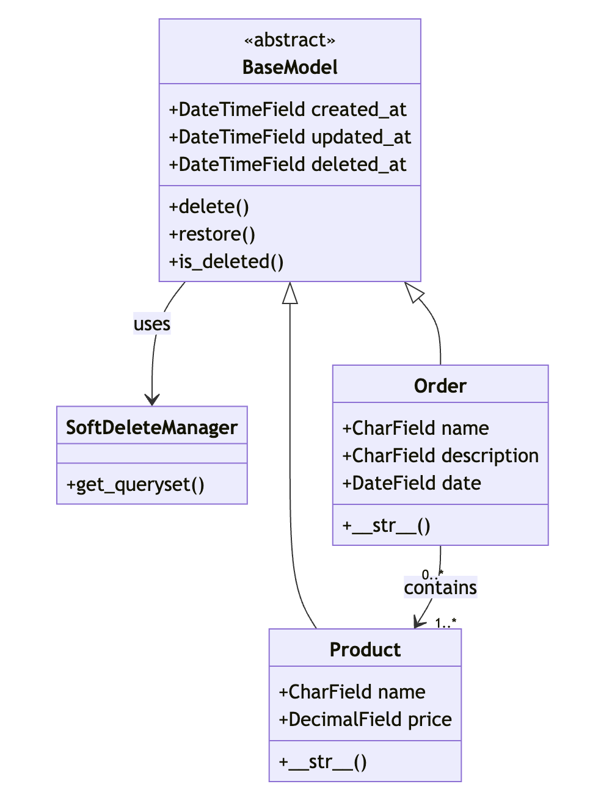

# Iliad Technical Test (September 2024)
Repository for the delivery of the Iliad technical test for the position of Python back-end developer.
The project consists of a simple Django REST backend developed with the help of Django REST Framework, executable via docker.


## Table of contents
* [Implementation details](#implementation-details)
* [Project setup](#project-setup)
* [Resources consulted](#resources-consulted)


## Implementation details
With the aim of developing a backend for a store, the objective of the project is to define and implement APIs that allow the frontend to manage orders, in particular:
* show all orders filterable by date range and searchable by name and/or description
* view the details of an order
* modify and delete an order

In addition to the realization of the APIs, the work focuses on defining the supporting database, containerizing the project, and covering automated tests.
In the implementation, we tried to follow the DRY (Don't Repeat Yourself) principle where possible and Django best practices.

### Technologies used
* Backend: Django 5.1.1 and Django Rest Framework (DRF) 3.15.2
* Database: PostgreSQL 16 (with Django ORM)
* Containerization: Docker 26.1.1

### Database architecture
The schema is mainly composed of two tables, in a many-to-many relationship:
* **Order** which contains the main information of the order (name and order date) with the associated products
* **Product** which contains the information of the single product (name, description, price)

Compared to the proposed base structure, changes were made to improve data management.
In particular, taking advantage of Django Models and the inheritance of a specific base class, the fields *created_at*, *updated_at*, and *deleted_at* were added to both tables, also implementing a **soft delete** mechanism. Thanks to this, it's possible to obtain more structured data and ensure the preservation of the order history even in case of deletion of a product.



### Functionalities
In addition to the basic REST APIs available for both described entities, the system supports:
* **Soft delete** - the deletion of a record does not occur directly on the database but by valuing an indicator: the *deleted_at*. The system is set up to display only active records by filtering those with *deleted_at* valued. The only exception concerns the display of orders in which associated products that have been subsequently deleted are also shown.
An API is also provided to restore deleted records.
* **Pagination** - configured globally for all APIs, with a default of 100 elements per single page.
* **Documentation and Swagger** - made available using the **drf-spectacular** library and reachable at the addresses `api/schema/redoc/` and `api/schema/swagger-ui/` respectively, they contain all the details on the available APIs.
* **Django admin console** - enabled by registering a superuser at `admin/`.


## Project setup
### Prerequisites
To correctly start the project, the following system dependencies are necessary:
* Docker: [Install Docker](https://www.docker.com/get-started)
* Docker Compose: [Install Docker Compose](https://docs.docker.com/compose/install/)
* Make library (optional)

### Configuration
The project is configured so that the Django server container is started only after the correct start of the database container. At each start, the database migration and static collect operations are also performed (refer to the `entrypoint.sh` file for further details).

Note: For the purposes of the project, a production setup for deployment is not provided, but only the internal Django development server is used. To this end, it is necessary to extend the configuration to include WSGI and NGINX, as well as separate management of environment variables.

### Main commands
To manage Docker and Django commands, a Makefile is provided. For all other available commands, refer directly to the file.
   ```bash
   # Docker related
   make build
   make up
   make down
   make logs

   # Django related
   make shell
   make migrate
   make createsuperuser
   make loadfixtures
   make test
   ```

### Initial setup and configuration
1. **Clone the repository**:
   ```bash
   git clone https://github.com/Aleberello/iliad-tt.git
   cd iliad-tt
   ```

2. **Environment parameters**: Edit the default configuration parameters for Django and the db contained in the .env file to change default super admin and db credentials.

3. **Build and start containers**:
   ```bash
   make build
   make up
   ```
   This command will start Django server and Postgres services defined in the `docker-compose.yml` file, serving the application in debug mode at the address [http://localhost:8000](http://localhost:8000).

4. **Create Django superuser**: Create the superuser for the Django admin panel
   ```bash
   make createsuperuser
   ```

5. **Load fixtures**: Populate database using development fixtures made available in the `api/fixtures` folder
   ```bash
   make loadfixtures
   ```

### Testing
Tests are organized into unit and integration tests, covering the main functionalities of the API, divided between models, serializers and views.
```
backend/
   ├──...
   └──api/
      ├── tests/
      │   ├── test_models.py
      │   ├── test_serializers.py
      │   └── test_views.py
      └── ...
```

To run the tests, use the command:
```bash
make test
```

## Resources consulted
Below are the online documentation and resources used for the realization:
- [Django Documentation](https://docs.djangoproject.com/en/5.1/)
- [Django Rest Framework Documentation](https://www.django-rest-framework.org/)
- [drf-spectacular Documentation](https://drf-spectacular.readthedocs.io/en/latest/readme.html#installation)
- [Django Filter Documentation](https://django-filter.readthedocs.io/en/latest/guide/rest_framework.html)
- [Docker Documentation](https://docs.docker.com/reference/dockerfile/)
- [Django Styleguide](https://github.com/HackSoftware/Django-Styleguide)
- [Dockerizing Django with Postgres, Gunicorn, and Nginx](https://testdriven.io/blog/dockerizing-django-with-postgres-gunicorn-and-nginx/)
- [Building a Fullstack Application with Django, Django Rest, and Next.js](https://dev.to/koladev/building-a-fullstack-application-with-django-django-rest-nextjs-3e26)
- [Python CRUD REST API using Django, Postgres, Docker, and Docker Compose](https://dev.to/francescoxx/python-crud-rest-api-using-django-postgres-docker-and-docker-compose-4nhe)
- [Developing REST API using Django Rest Framework (DRF)](https://dev.to/mdrhmn/developing-rest-api-using-django-rest-framework-drf-1a95)
- [APIView vs ViewSet in Django Rest Framework](https://medium.com/@mathur.danduprolu/apiview-vsviewset-in-django-rest-framework-aa9a77921d53)
- [Testing Django and Django Rest Framework (DRF): Ensuring Reliability](https://medium.com/@akshatgadodia/testing-django-and-django-rest-framework-drf-ensuring-reliability-236f0fcbeee6)
- [Docker Django React](https://github.com/cglusky/docker-django-react)

Special thanks to ChatGPT, Claude, and Stack Overflow for being my debugging and test-writing superheroes!

---
@Author: Alessandro Bertolo